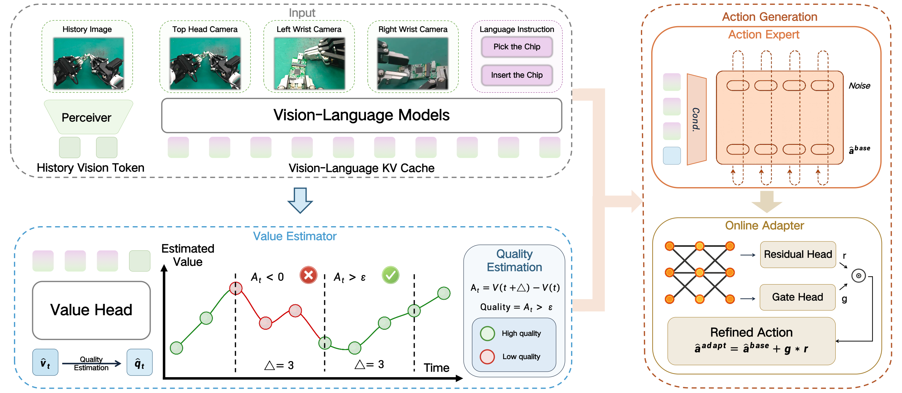

# Robo-ValueRL

<div id="top" align="center">

[](https://gewu-lab.github.io/Robo-ValueRL/)
[](https://scholar.google.com/citations?view_op=view_citation&hl=en&user=v69hlTUAAAAJ&citation_for_view=v69hlTUAAAAJ:5nxA0vEk-isC)
[](https://huggingface.co/X-Humanoid/Robo-ValueRL)
[](https://huggingface.co/datasets/X-Humanoid/Robo-ValueRL)

</div>

**Robo-ValueRL** is a value-guided, offline-to-online reinforcement learning framework for real-world robotic manipulation. It learns a **history-conditioned value estimator** that predicts task progress, reducing the ambiguity caused by partial observations and visual occlusions. The estimated value signal is then converted into per-action **quality labels**, which drive a **quality-conditioned consistency policy** trained through large-scale offline pretraining. The pretrained policy is deployed to collect real-world rollouts with human-in-the-loop intervention, and those rollouts further improve the policy through online adaptation.



The full pipeline addresses the gap between static human demonstrations and closed-loop deployment through four stages:

- **Value Estimation**: Train a history-conditioned value estimator that predicts the progress of a task to reduce ambiguity from partial observations and visual occlusions.
- **Quality Annotation**: Turn predicted task progress into dense, rank-based action-quality labels.
- **Offline Pretraining**: Pretrain the quality-conditioned consistency policy on offline data.
- **Online Adaptation**: Collect online rollouts (with RTC-based real-time chunking) and adapt the policy with online residual adaptation.

## Table of Contents

- [Update](#update)
- [Requirements](#requirements)
- [Preparation](#preparation)
  - [1. Installation](#1-installation)
  - [2. Download the dataset](#2-download-the-dataset)
  - [3. Convert dataset to LeRobot format](#3-convert-dataset-to-lerobot-format)
- [Path Configuration](#path-configuration)
- [Project Overview](#project-overview)
- [Stage 1 — Value Estimator](#stage-1--value-estimator)
- [Stage 2 — Value Annotation & Quality Generation](#stage-2--value-annotation--quality-generation)
- [Stage 3 — Offline Pretraining](#stage-3--offline-pretraining)
- [Deployment & Inference](#deployment--inference)
- [Stage 4 — Online Adaptation](#stage-4--online-adaptation)
- [License and Citation](#license-and-citation)
- [Links and Community](#links-and-community)

## Update

- **[Jul 2026]** Initial public release of Robo-ValueRL: value-estimator training, value annotation, quality generation, offline pretraining, and online adaptation pipelines.
- **[Jul 2026]** Model checkpoints and dataset released on [Hugging Face](https://huggingface.co/collections/X-Humanoid/robo-valuerl).

## Requirements

### Hardware

Robo-ValueRL is validated on a real-world dual-arm humanoid robot (X-Humanoid-tienkung) with a three-camera setup (head / left wrist / right wrist). Deployment uses a two-machine layout: a **GPU policy server** running the model and a **robot host** that streams observations and executes returned action chunks over a socket connection (see [Deployment & Inference](#deployment--inference)).

### Compute requirements

| Stage                                   | GPU                        |
| --------------------------------------- | -------------------------- |
| Real-robot deployment (inference)       | A single **RTX 4090**      |
| Value / policy training                 | **8x A100** (multi-GPU)       |

Distributed training is launched with `torchrun` and defaults to **8 GPUs per node**, optionally across multiple nodes.

## Preparation

### 1. Installation

We provide a one-command install script that creates a conda environment and installs LeRobot, the Robo-ValueRL package, and openpi:

```bash
bash install_simple.sh
```

Besides installing the local requirements of LeRobot and openpi, the script copies `openpi/src/openpi/models_pytorch/transformers_replace/*` into your site-packages `transformers/` directory — this patch is required for the PyTorch π₀ / π₀.₅ backbone to run correctly. See [`install_simple.sh`](install_simple.sh) for the exact steps.

### 2. Download the dataset

Download the Robo-ValueRL dataset from [Hugging Face](https://huggingface.co/datasets/X-Humanoid/Robo-ValueRL) and place it under `RVRL_DATA_ROOT` (see [Path Configuration](#path-configuration)). The dataset is provided in LeRobot v2.1 format with per-frame `remain_time` and `quality` fields used by the value-guided pipeline.

### 3. Convert dataset to LeRobot format

We already ship the converted LeRobot dataset. If instead you want to convert raw `trajectory.hdf5` recordings to LeRobot v2.1 format yourself, use:

```bash
python lerobot_filter/parallel_convert_hdf5_to_lerobot.py \
    --task_name <task_name> \
    --raw_data_dir <dir_with_trajectory_hdf5> \
    --output_dir <output_dataset_dir>
```

`--task_name`, `--raw_data_dir`, and `--output_dir` are required. Common optional flags: `--fps` (default 30), `--chunk_size` (episodes per chunk dir), `--max_workers` (parallel workers, defaults to CPU count), `--overwrite` (clear the output dir first), and `--skip_failed` (continue past corrupt trajectories). The script converts every trajectory to LeRobot format and writes it to the output directory with multi-process parallelization.

## Path Configuration

All dataset and checkpoint locations are resolved at runtime from two environment variables (with repo-relative fallbacks), via [`openpi/src/openpi/training/paths.py`](openpi/src/openpi/training/paths.py). Set them once to wherever you downloaded the data and weights:

```bash
export RVRL_DATA_ROOT=/your/datasets      # where the LeRobot datasets live
export RVRL_CKPT_ROOT=/your/checkpoints   # where model weights / checkpoints live
```

| Variable          | Default                          | What it points to                                            |
| ----------------- | -------------------------------- | ------------------------------------------------------------ |
| `RVRL_DATA_ROOT`  | `./data`                         | Root of all LeRobot datasets (`root`, `filtered_bc_root`, `openx_root`, `rollout_root`). |
| `RVRL_CKPT_ROOT`  | `./checkpoints`                  | Root of model weights / checkpoints (`pytorch_weight_path`). |
| `RVRL_NORM_STATS` | `robo_valuerl/humanoid_delta_fast_stats.json` (shipped in-repo) | Normalization stats JSON. Override only if you recomputed your own. |

The dataset **sub-directory structure is preserved relative to `RVRL_DATA_ROOT`**, so the sub-paths inside the configs double as documentation of the layout each config expects. For example, `stack_all_hours_data_pretraining` reads from `${RVRL_DATA_ROOT}/rl_block_x_humanoid_data/stack_pretraining_all_data_strict_30`, and the `repo_ids` list names the exact dataset folders that must sit under it. Arrange your downloaded data to match these sub-paths (or symlink them) and no config edits are needed.

> The three release configs (`stack_all_hours_data_pretraining`, `all_value_function_training`, `online_adaptation`) live in [`openpi/src/openpi/training/config.py`](openpi/src/openpi/training/config.py). Legacy experiment configs under `robo_valuerl/config/train_config.py` are not part of the release pipeline and may still contain original absolute paths.

## Project Overview

```
+---------------------------------------------------------------------------------------------------+
|                                   Robo-ValueRL Framework Overview                                  |
|      Built on openpi (pi0 / pi0.5 VLA) + LeRobot v2.1 + a socket policy-server / robot-client      |
+---------------------------------------------------------------------------------------------------+
|                                                                                                   |
|   +----------------+     +----------------+     +----------------+     +----------------+          |
|   | Value          |     | Value Annotate |     | Quality        |     | Offline        |          |
|   | Estimator      |---->| remain_time    |---->| Generation     |---->| Pretraining    |          |
|   | (remain-time   |     | prediction     |     | rank-based     |     | quality-cond.  |          |
|   |  regression)   |     | on offline data|     | good/med/bad   |     | consistency    |          |
|   +----------------+     +----------------+     +----------------+     +--------+-------+          |
|   train_robo_valuerl_    annotate_value_        generate_action_       train_robo_value|          |
|   value_estimator.py     function_sparse_       quality/generate_      _rl_offline_rl.py|          |
|                          part.py                quality.py                      |                  |
|                                                                                 v                  |
|                                                                        +----------------+          |
|   +----------------+     +----------------+     +----------------+     | Online         |          |
|   | Robot Host     |<--->| Policy Server  |<----| RTC Real-Time  |<----| Adaptation     |          |
|   | (obs / exec)   |socket (GPU inference) |     | Chunking env   |     | value-guided RL|          |
|   +----------------+     +----------------+     +----------------+     +----------------+          |
|   rl_envs/realworld_     agent_server_          env_rtc_with_          train_robo_value            |
|   x_humanoid_env.py      policy.py / _rtc_*.py  delta.py               _rl_online_rl.py            |
|                                                                                                   |
+---------------------------------------------------------------------------------------------------+
```


## Stage 1 — Value Estimator

Train a history-conditioned, VLA-based value estimator that predicts the **remaining time to completion** for every observation. This value function is the backbone of the whole pipeline: its predictions are later turned into action-quality labels and used to condition the policy.

```bash
cd robo_valuerl
bash scripts/train_robo_valuerl_value_estimator.sh
```

Under the hood this launches distributed training (8 GPUs/node via `torchrun`):

```bash
torchrun --nproc_per_node=8 --nnodes=$NNODES --node_rank=$NODE_RANK \
    --master_addr=$MASTER_ADDR --master_port=$MASTER_PORT \
    train_robo_valuerl_value_estimator.py all_value_function_training \
    --exp_name test --batch-size 1024 --decay_steps 10000 --lr 2e-4 \
    --sample_from_ratio 1 --only-load-paligemma
```

Key flags: `all_value_function_training` selects the value-function data config, `--only-load-paligemma` initializes from the PaliGemma backbone weights, and multi-node runs are controlled via the `MASTER_ADDR` / `MASTER_PORT` / `WORLD_SIZE` / `RANK` environment variables.

## Stage 2 — Value Annotation & Quality Generation

**Step 2a — Annotate remaining time.** Use the trained value estimator to predict and write per-frame remaining time into the offline dataset:

```bash
cd robo_valuerl
python annotate_value_function_sparse_part.py all_value_function_training \
    --exp_name test \
    --pytorch-weight-path <value_estimator_model_path> \
    --annotation_dir_root <offline_data_dir> \
    --annotate_total 2 --annotate_count 0 --history_length 5
```

`--annotate_total` / `--annotate_count` shard the dataset for parallel annotation across processes/machines; `--history_length` sets the observation history window fed to the estimator.

**Step 2b — Generate action quality.** Convert the annotated remaining-time signal into rank-based action-quality labels. For each 50-frame chunk the script sums the remaining-time decrease `sum(prt[t] - prt[t+50])`, ranks all chunks globally, and assigns **GOOD / MEDIUM / BAD** labels (with a minimum-score threshold), overwriting the `quality` field in the parquet files and optionally rendering visualization videos:

```bash
cd robo_valuerl
python generate_action_quality/generate_quality.py --data_dir <offline_data_dir>
```

## Stage 3 — Offline Pretraining

Pretrain the quality-conditioned consistency policy on the annotated offline data:

```bash
cd robo_valuerl
bash scripts/train_robo_valuerl_offline.sh
```

Which expands to:

```bash
torchrun --nproc_per_node=8 --nnodes=$NNODES --node_rank=$NODE_RANK \
    --master_addr=$MASTER_ADDR --master_port=$MASTER_PORT \
    train_robo_value_rl_offline_rl.py stack_all_hours_data_pretraining \
    --exp_name test --batch-size 768 --decay_steps 30000 --lr 1e-4 \
    --sample_from_ratio 1 --only-load-paligemma
```

`stack_all_hours_data_pretraining` is the offline pretraining data config that stacks all available demonstration hours. The resulting checkpoint is the policy that gets deployed for rollout collection and, subsequently, online adaptation.

## Deployment & Inference

Once you have a pretrained policy, deploy it on the real robot. Deployment uses a **two-machine socket setup**: a GPU host runs the policy server, and the robot host streams observations and executes the returned action chunks.

**Start the policy server** (GPU host):

```bash
cd robo_valuerl
# standard policy inference server
python deploy_bc.py config_name --exp-name test --pytorch-weigth-path <offline_checkpoint_path>

# or the RTC-guided server (accepts A_prev, d, s parameters for real-time chunking)
python deploy_robo_valuerl.py config_name --exp-name test --pytorch-weigth-path <offline_checkpoint_path>
```

**Open the other terminal and run** RTC real-time chunking and delta-action execution:

```bash
python rtc_env_client_inference_with_delta.py
```

The real-world environment wrappers live under [`robo_valuerl/rl_envs/`](robo_valuerl/rl_envs) (`realworld_x_humanoid_env.py` for the X-Humanoid platform), and the RTC-with-intervention rollout environments are `env_rtc_with_delta.py` / `env_with_rtc_intervention.py` (used for online data collection with human-in-the-loop interventions).

## Stage 4 — Online Adaptation

After collecting online rollouts on the real robot, convert the online buffer to LeRobot format and adapt the policy with value-guided online RL:

```bash
cd robo_valuerl
# (optional) convert collected online buffer to a LeRobot dataset
python convert_online_buffer_to_lerobot_multi.py --help

# run online adaptation, initialized from the offline-pretrained checkpoint
bash scripts/train_robo_valuerl_online.sh
```

The online script (`train_robo_value_rl_online_rl.py online_adaptation`) resumes from `--pytorch-weight-path $CKPT_PATH` (set `CKPT_PATH` inside `scripts/train_robo_valuerl_online.sh` to your offline checkpoint) and runs a shorter schedule (`--decay_steps 2000`) to adapt the pretrained policy on freshly collected rollouts.

## License and Citation


```bibtex
@misc{xia2026robovaluerlreliablevalueestimation,
      title={Robo-ValueRL: Reliable Value Estimation for Offline-to-Online Reinforcement Learning},
      author={Wenke Xia and Pei Ren and Wenbo Yu and Yizhuo Zhang and Jifan Li and Yixue Zhang and Yinuo Zhao and Qingyang Gao and Jianlong Fu and Jian Tang and Ji-Rong Wen and Zhengping Che and Di Hu},
      year={2026},
      eprint={2607.09866},
      archivePrefix={arXiv},
      primaryClass={cs.RO},
      url={https://arxiv.org/abs/2607.09866},
}
```


## Links and Community

- [Project Page](https://gewu-lab.github.io/Robo-ValueRL/)
- [Paper](https://drive.google.com/file/d/1c0dt50iH554GrY2PEDoP3XMLYZ0SuqqH/view?usp=drive_link)
- [Model (Hugging Face)](https://huggingface.co/X-Humanoid/Robo-ValueRL)
- [Dataset (Hugging Face)](https://huggingface.co/datasets/X-Humanoid/Robo-ValueRL)
- [openpi (Base Repository)](https://github.com/Physical-Intelligence/openpi)
- [LeRobot (Dataset Format & Tooling)](https://github.com/huggingface/lerobot)
